### Olá! Eu sou o Ivo Henrique 😁
---
**`Computer Engineering Student`**

Me chamo Ivo Henrique, sou estudante de Engenharia da Computação pela Universidade Do Estado de Minas Gerais (UEMG). Meu primeiro contato com o mundo da programação foi em 2020, porém, só vim começar a programar de verdade dois anos depois. Atualmente  procuro desenvolver as habilidades obtidas com o decorrer da faculdade. 

 
 
---
### 📊 Estatísticas

### 💻 Linguagens e Tecnologias

 
 
